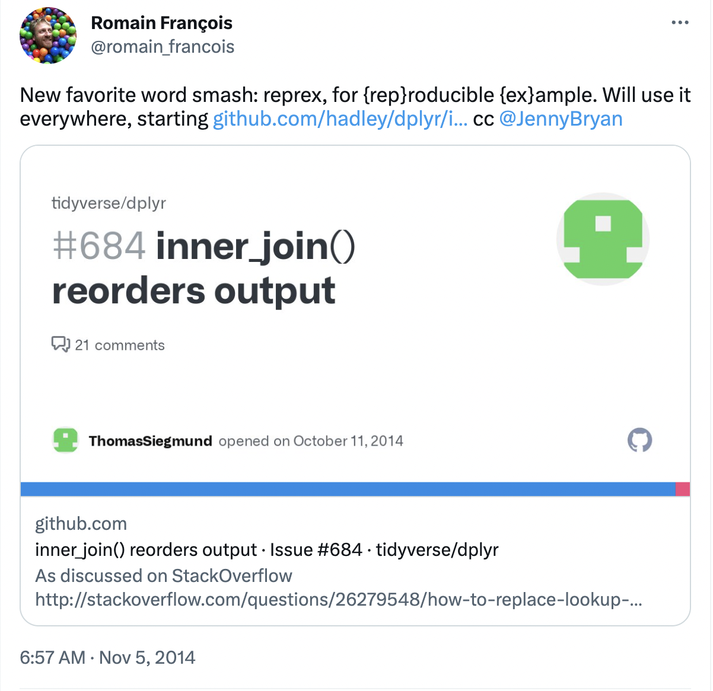
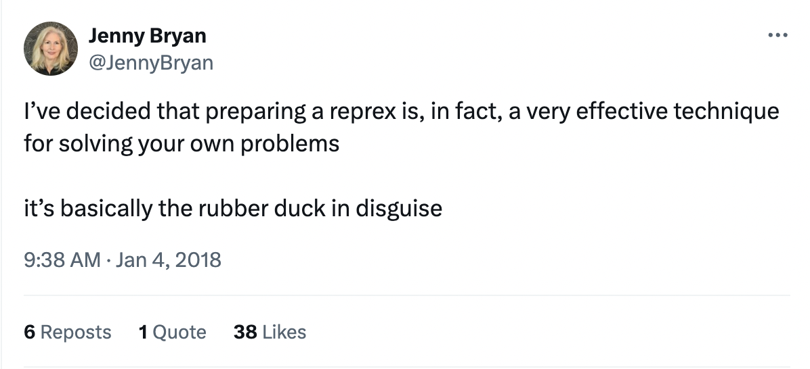

:::::::::::::::::::::::::::::::::::::: questions 
- How is the process of getting help in R different from getting help with other things?
- Why is a minimal reproducible example an important tool for getting help in R?
- What will we be learning in the rest of the course?
::::::::::::::::::::::::::::::::::::::::::::::::

::::::::::::::::::::::::::::::::::::: objectives

- Recognize what it takes to debug someone else's code.
- Define a minimal reproducible example.
- Describe the general workflow that we will cover in the rest of this lesson.

::::::::::::::::::::::::::::::::::::::::::::::::

#### Welcome and introductions
- Welcome to "RRRR, I'm Stuck!" We're glad you're here! Let's first take care of a few setup steps. You should have all followed the setup instructions on the [workshop website](kaijagahm.github.io/R-help-reprexes/), and you should have both R and RStudio installed.
 
- You should also have the following packages installed: {**reprex**}, {**ratdat**}, {**dplyr**}, and {**ggplot2**}.

- We have a range of levels of experience here. This workshop assumes that you are researcher in ecology or biology who has some prior experience working with R in RStudio.

- The examples in this lesson follow an example data wrangling, visualization, and analysis workflow similar to one that might be used by an ecology researcher. We will not spend much time discussing the code itself. [Reference guide?]

- It's okay if you're not an R expert--but even more experienced R coders might be less familiar with how to get unstuck, so we hope this workshop will be useful to many levels of coding background.

:::::::::::::::::::::::::::::::::::::: challenge 
## Think, pair, share: When you get stuck

When you're coding in R and you get stuck, what are some things that you do to get help or get unstuck?
::::::::::::::::::::::::::::::::::::::::::::::::

:::::::::::::::::::::::::::::::::::::: challenge 
## Think, pair, share: Helping someone else

Think about a time that you helped someone else with their code. What information did you need to know in order to help?
(If you have never helped someone else with their code, think about a time that someone helped you--what information did they need to know in order to help?)
::::::::::::::::::::::::::::::::::::::::::::::::

Fixing problems can be one of the most challenging parts of learning to code. Luckily, there are many people in the R and data science communities that will be able to help when you get stuck. However, learners and potential helpers alike often run into trouble when they try to communicate about broken code. Helping someone to fix their code can feel impossible when they don't give you enough information to replicate the problem. But as a novice, figuring out how to ask a good question can feel even harder than the original problem that got you stuck in the first place!

When you get stuck, often the first step is to try some strategies on your own to fix your code. This might include reading help resources, investigating error messages, and methodically walking through each line of your code to figure out what might have gone wrong. But it's also very common to ask for help from someone else, such as a colleague or strangers online.

Asking for help with your code is a little different than asking for help with many other things. That's because it is usually not enough to describe the problem in general or theoretical terms. Most help forums (StackOverflow, the Posit Community, and the R for Data Science Slack workspace are common places to ask for help with R code!) require users to post a description of their problem along with a minimal reproducible example, or "**reprex**", of their code to make it easier for helpers to figure out what the problem is.

::: callout
A **minimal reproducible example** (MRE) is also sometimes called a **minimal working example** (MWE), or a **reprex** (which is short for "reproducible example"). We will mostly use the term **reprex** in this lesson.

The term **reprex** was coined by Romain François in a 2014 tweet:

:::

As the name suggests, a reprex should be:

1. Minimal. It's important to strip the code and data down to their simplest parts and remove anything that is not directly relevant to the problem. This makes it easy for a helper to zero in on what might be going wrong. It also makes the helping process simpler for the helper, making them more likely to take the time to work on your problem. 

2. Reproducible. The reprex should recreate the problem you're encountering, and it needs to be runnable by someone other than you, on a different computer.

Why is reproducibility important? In many disciplines, experts can give helpful abstract advice about problems. Coding is very hands-on. Even experts usually have to "tinker" with a problem before they can determine what is happening. Without the ability to "tinker", debugging is both difficult and frustrating, which means that you are less likely to get help.

The Tidyverse documentation puts it simply:

>"The goal of a reprex is to package your problematic code in such a way that other people can run it and feel your pain. Then, hopefully, they can provide a solution and put you out of your misery." - [Get help! (Tidyverse)](https://www.tidyverse.org/help/)

::: callout
## The wrong ways to ask questions
- Screenshots
- Descriptions of the data
- "It doesn't work"
XXX expand on this--not sure about the best way/time to introduce these "don't"s. Maybe not at all?
:::

As an added bonus, the process of simplifying your problem and creating a reprex often leads to a better understanding of your own code!

In fact, the phenomenon of solving one's own problem during the process of trying to explain it clearly to someone else is well known--it's often called "[rubber duck debugging](https://en.wikipedia.org/wiki/Rubber_duck_debugging)". Jenny Bryan, who created a great video about reprexes called "[Help me help you](https://www.youtube.com/watch?v=5gqksthQ0cM&ab_channel=PositPBC)", called reprexes "basically the rubber duck in disguise".

Making a reprex might seem simple in theory, but it can be challenging to put into practice. In this lesson, we will walk through the process of creating a minimal reproducible example. We'll talk about each of the steps and provide a workflow that you can follow when you get stuck in the future. At the end, we'll introduce you to the `{reprex}` package, a useful tool for creating good minimal reproducible examples.

## Overview of this lesson
[XXX visual for the roadmap? or just an outline?]

::::::::::::::::::::::::::::::::::::: keypoints 
- A helper usually needs to run your code in order to debug it.
- Minimal reproducible examples make it possible for helpers to run your code, which lets them "feel your pain" and figure out what's wrong.
- Making a minimal reproducible example helps you understand your own problem and often leads to finding the answer yourself!
::::::::::::::::::::::::::::::::::::::::::::::::
